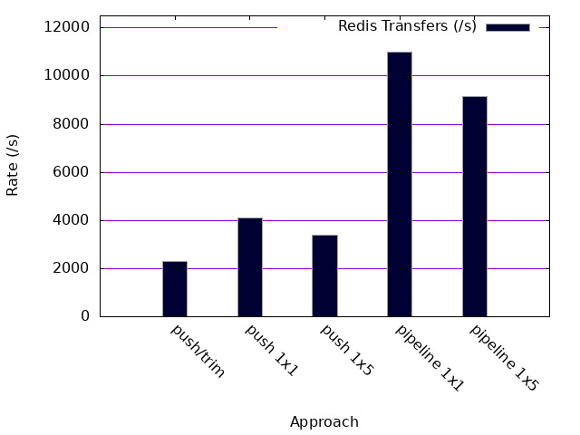

# REDIS Benchmarkk

## Use Redis as a FIFO Queue

1. Python client injects 200,000 messages as encoded json on REDIS key
2. Another client performs a blocking pop of each message and counts the event rate

### Hardware

Timing is performed on MacBook Pro running Docker from a Debian stable-slim base image.

#### using i7 2019 MacBook Pro (Unscientific)
#### Intel(R) Core(TM) i7-9750H CPU @ 2.60GHz

### Caveat 

This is a 'best effort' benchmark.   The goal of this work is to produce a ballpark estimate of queue performance for Redis.  Only slight effort has been made to tune the results.


### QuickStart 

#### Run with 1 x 1 push - pull

```
$ docker-compose build && docker-compose up
```

### Run with 1 x 5 push - multiqueue 
```
$ docker-compose build && docker-compose up --scale puller=5
```

## Results



1x1

# Push followed by ltrim

Redis is limiting throughput to around 2000 messages each second

```
pusher_1  | INFO:root:200000 sent on 1 puller
pusher_1  | INFO:root:2281.272853/s
puller_1  | INFO:root:200000 events
puller_1  | INFO:root:2145.098716/s
```

# Push on its own

This accounts for a factor of 2 speedup
```
pusher_1  | INFO:root:200000 sent on 1 puller
pusher_1  | INFO:root:4102.665710/s
puller_1  | INFO:root:145013 events
puller_1  | INFO:root:2719.217568/s
```

# Push to 5 listening processes
1x5
```
pusher_1  | INFO:root:200000 sent on 5 puller
pusher_1  | INFO:root:3427.435369/s
puller_1  | INFO:root:94987 events
puller_1  | INFO:root:1609.770198/s
puller_2  | INFO:root:40000 events
puller_2  | INFO:root:685.363585/s
puller_3  | INFO:root:40000 events
puller_3  | INFO:root:688.337254/s
puller_4  | INFO:root:40000 events
puller_4  | INFO:root:688.684111/s
puller_5  | INFO:root:40000 events
puller_5  | INFO:root:634.297735/s
```

# Push 5 messages at a time pipelined

The follower can not keep up with the sending rate

1x1 Pipelined
```
pusher_1  | INFO:root:200000 sent on 1 puller
pusher_1  | INFO:root:11041.361446/s
puller_1  | INFO:root:200000 events
puller_1  | INFO:root:2665.768506/s
```

# Push 5 messages at a time pipelined to 5 followers

1x5 Pipelined
```
pusher_1  | INFO:root:500000 sent on 5 puller
pusher_1  | INFO:root:9152.417832/s
puller_1  | INFO:root:99627 events
puller_1  | INFO:root:1701.411370/s
puller_2  | INFO:root:99627 events
puller_2  | INFO:root:1858.938501/s
puller_3  | INFO:root:99625 events
puller_3  | INFO:root:1852.108130/s
puller_4  | INFO:root:99626 events
puller_4  | INFO:root:1854.587463/s
puller_5  | INFO:root:99626 events
puller_5  | INFO:root:1851.010421/s
```

